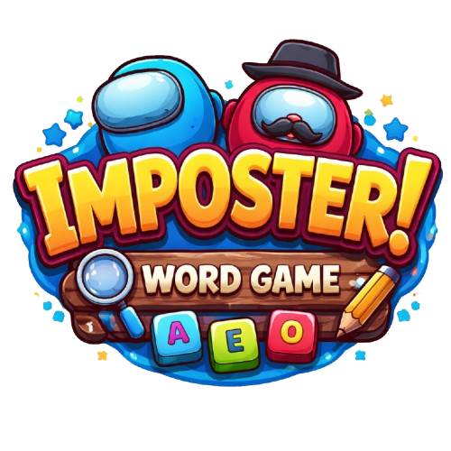

# 🎭 Word Imposter

A fun party game where everyone gets a word - but someone has a different one! Find the imposter before they blend in.



## 🎮 How to Play

1. **Add Players** - Minimum 3 players required
2. **Reveal Words** - Pass the phone around, each player sees their secret word
3. **Discuss** - Describe your word without saying it directly
4. **Vote/Pick** - Find who has the different word!
5. **Multi-round** - Game continues if you pick wrong

## ✨ Features

- 🎲 **Multiple Categories** - Sports, Bollywood, Food, Animals, and more
- ✏️ **Custom Words** - Add your own categories and word sets
- 👥 **3-10 Players** - Perfect for small to medium groups
- 🔄 **Multi-round** - Game continues until imposters win or get caught
- 👆 **Group Pick Mode** - Direct elimination without voting
- ❓ **Anonymous Mode** - Hide imposter/civilian roles, only show words
- 💾 **Remembers Players** - Player list saved across sessions

## 🚀 Quick Start

```bash
# Clone the repo
git clone https://github.com/Tanim-10/word-imposter-game.git
cd word-imposter-game/frontend

# Install dependencies
npm install

# Start dev server
npm run dev
```

Open **http://localhost:5173** in your browser.

## 🛠️ Tech Stack

- **React** + **Vite** - Fast development
- **Tailwind CSS** - Styling
- **React Router** - Navigation
- **LocalStorage** - Player & custom category persistence

## 📁 Project Structure

```
frontend/
├── src/
│   ├── components/     # Button, Modal, Footer, etc.
│   ├── context/        # GameContext, WordContext
│   ├── pages/          # Home, Setup, Reveal, Voting, Results
│   ├── data/           # Word categories
│   └── constants/      # Game rules
├── public/
│   └── logo.png
└── index.html
```

## 🎨 Customization

### Add Custom Categories
1. Open the game → Click **"Custom Words"**
2. Add category name and word sets
3. Format: One set per line, words comma-separated

### Modify Built-in Categories
Edit `frontend/src/data/categories.js`

## 📱 Game Settings

| Setting | Options | Default |
|---------|---------|---------|
| Roles | Show / Hide | Hide |
| Voting | Individual / Group Pick | Group Pick |
| Imposters | 1-3 | 1 |
| Categories | Select multiple | All |

## 🤝 Contributing

Contributions welcome! Feel free to:
- Add new word categories
- Improve UI/UX
- Fix bugs
- Add new features

## 📄 License

MIT License - Feel free to use and modify!

---

Made with ❤️ by [Tanim](https://github.com/Tanim-10)
